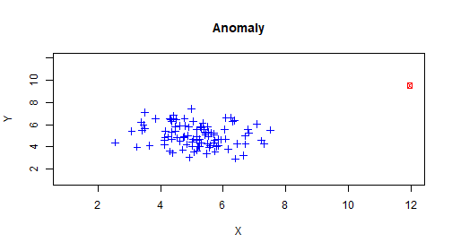

## Anomaly Detection

- At work I anaylize software system data
- Most of it isn't interesting, but occasionally something abnormal happens
- My goal is to find out when that happens and why
- To do this I look for anomalies



--- .class #1

## How to find Anomalies in Data 
- There are a couple ways to find them
1. Density
2. Distance
3. Statistical Properties

Density  | Distance | Statistical
---------| ---------|------------
LOF      | Kmeans   | Parametric Models
CBOF     | Knn      | Mean, Var, Stdev
DENLCUE  | LDOF     | Distribution Assumptions

--- .class #2


## Don't Fear!

- Building some of the models mentioned is difficult
- Luckily R has many models already made
- Kmeans is an example
- Caret also has a ton of built in functions for ML and Anomaly Detection

--- .class #3

## I'll help you get started

- https://kgartrell.shinyapps.io/Finding_Anomalies/
- That link goes to a shiny app that highlights Anomalies using Kmeans

--- .class #4

## Hopefully You Found This Interesting!

- Good luck coming up with your own algorithms


```r
2+2
```

```
## [1] 4
```

### Kindest Regards,
### Kyle

--- .class #5

